# ML RAG Strategies

A collection of Retrieval-Augmented Generation (RAG) strategies with Python code samples. Each strategy demonstrates a different approach to improving retrieval quality, generation accuracy, or overall RAG pipeline performance.

## Setup

```bash
pip install -r requirements.txt
export OPENAI_API_KEY="your-api-key-here"
```

> **Security Note:** Never hardcode API keys. All samples read credentials from environment variables. Review retrieved content before using it in production to prevent prompt injection attacks.

---

## Strategy Overview

| # | Strategy | Example Use Case |
|---|----------|-----------------|
| 1 | Re-Ranking | Customer support bot re-scoring FAQ matches to surface the most relevant answer |
| 2 | Agentic RAG | Research assistant that decides whether to search docs, web, or databases based on the question |
| 3 | Knowledge Graph RAG | Medical Q&A traversing drug-gene-disease relationships for multi-hop answers |
| 4 | Contextual Retrieval | Legal document search where isolated clauses lose meaning without contract context |
| 5 | Query Expansion | E-commerce search matching "laptop" with results about "notebook computer" |
| 6 | Multi-Query RAG | Answering "Compare React and Vue performance and ecosystem" by splitting into sub-questions |
| 7 | Context-Aware Chunking | Technical manuals where fixed splits would break mid-procedure or mid-table |
| 8 | Late Chunking | Academic papers where pronoun references ("this method") span multiple paragraphs |
| 9 | Hierarchical RAG | Large codebases — first find the relevant module summary, then drill into specific functions |
| 10 | Fine-Tuned RAG | Domain-specific search in biomedical literature using specialized terminology |
| 11 | HyDE | Vague user queries like "how to fix slow builds" matched against detailed solution docs |
| 12 | RAG-Fusion | Product search combining results from multiple query rephrasings via rank fusion |
| 13 | Self-RAG | Chatbot that skips retrieval for greetings but fetches docs for technical questions |
| 14 | Corrective RAG (CRAG) | Internal wiki Q&A that falls back to web search when local docs are insufficient |
| 15 | Adaptive RAG | Help desk routing simple FAQs to direct lookup and complex issues to multi-step retrieval |

---

## Strategies

### 1. Re-Ranking

**What it does:** Retrieves a broad set of candidate documents using fast vector search, then re-scores them with a cross-encoder model to surface the most relevant results.

**Why it helps:** Bi-encoder retrieval is fast but approximate. Cross-encoders jointly encode the query-document pair, producing more accurate relevance scores at the cost of speed — applied only to the top-N candidates.

**Architecture:**

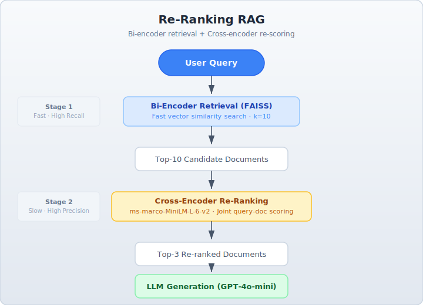

**Code:** [`src/reranking/reranking_rag.py`](src/reranking/reranking_rag.py)

---

### 2. Agentic RAG

**What it does:** An LLM agent autonomously decides *when* to retrieve, *what* to search for, and *how* to combine results. The agent can call retrieval tools, reason over results, and perform multi-step lookups.

**Why it helps:** Static retrieve-then-generate pipelines can't adapt to query complexity. An agent dynamically plans retrieval steps, handles follow-up questions, and knows when it already has enough context.

**Architecture:**

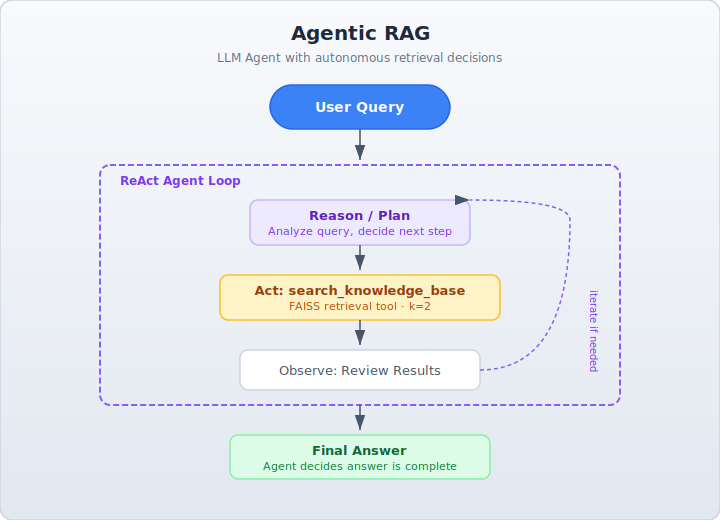

**Code:** [`src/agentic_rag/agentic_rag.py`](src/agentic_rag/agentic_rag.py)

---

### 3. Knowledge Graph RAG

**What it does:** Structures documents as a knowledge graph (entities + relationships) and retrieves by traversing graph neighbors rather than vector similarity alone.

**Why it helps:** Graphs capture explicit relationships between entities that embeddings may miss. Traversal retrieval excels at multi-hop reasoning (e.g., "What methods does RAG use for retrieval?").

**Architecture:**

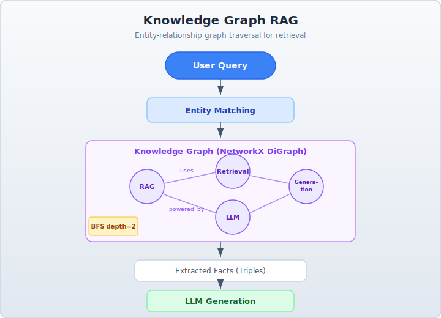

**Code:** [`src/knowledge_graph_rag/knowledge_graph_rag.py`](src/knowledge_graph_rag/knowledge_graph_rag.py)

---

### 4. Contextual Retrieval

**What it does:** Before embedding, prepends a short LLM-generated context summary to each chunk that explains how it fits within the full document.

**Why it helps:** Isolated chunks lose document-level context (e.g., "it" or "this method" becomes ambiguous). Adding context to each chunk makes embeddings more informative and retrieval more precise.

**Architecture:**

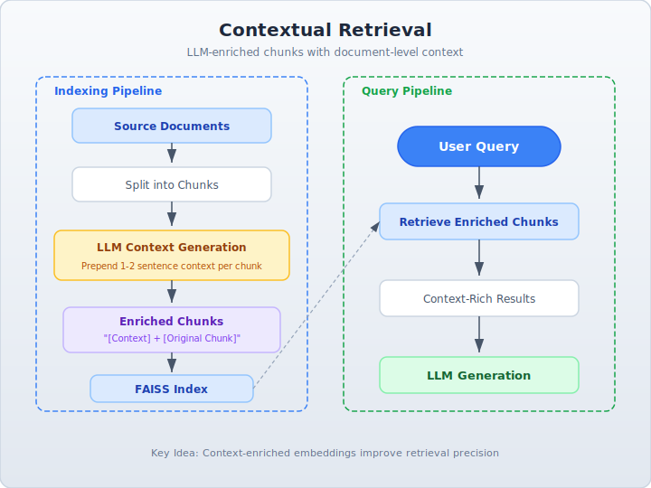

**Code:** [`src/contextual_retrieval/contextual_retrieval.py`](src/contextual_retrieval/contextual_retrieval.py)

---

### 5. Query Expansion

**What it does:** Rewrites the user query into multiple alternative phrasings (synonyms, paraphrases) and retrieves for each variant, then deduplicates results.

**Why it helps:** A single query may miss relevant documents due to vocabulary mismatch. Multiple rephrasings improve recall by covering different ways the same concept might be expressed.

**Architecture:**

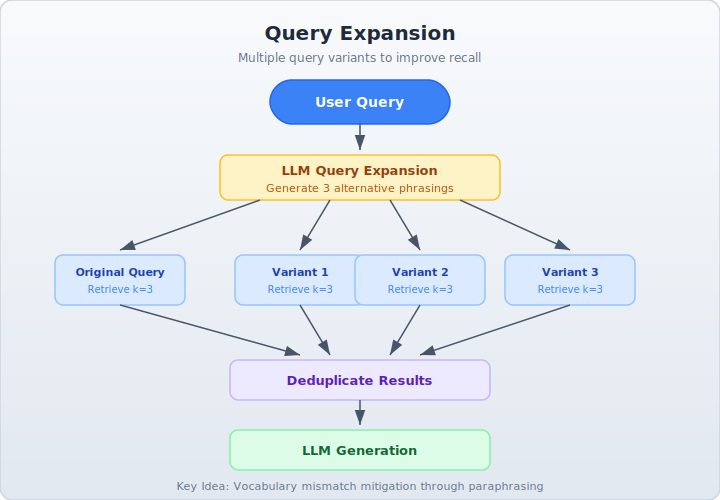

**Code:** [`src/query_expansion/query_expansion.py`](src/query_expansion/query_expansion.py)

---

### 6. Multi-Query RAG

**What it does:** Decomposes a complex question into independent sub-questions, retrieves separately for each, and synthesizes a unified answer.

**Why it helps:** Complex questions often span multiple topics. Decomposition ensures each aspect gets dedicated retrieval, reducing the chance of missing relevant context.

**Architecture:**

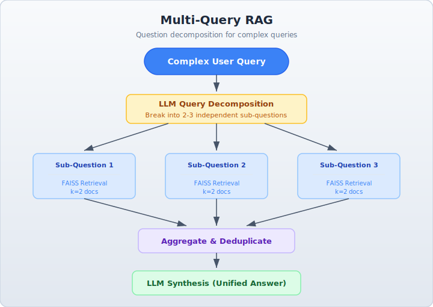

**Code:** [`src/multi_query_rag/multi_query_rag.py`](src/multi_query_rag/multi_query_rag.py)

---

### 7. Context-Aware Chunking

**What it does:** Splits documents along semantic boundaries (headings, paragraphs, topic shifts) rather than fixed token counts, with optional sentence overlap between chunks.

**Why it helps:** Fixed-size chunking can split mid-sentence or mid-concept. Semantic chunking preserves coherent units of meaning, and overlap ensures context isn't lost at chunk boundaries.

**Architecture:**

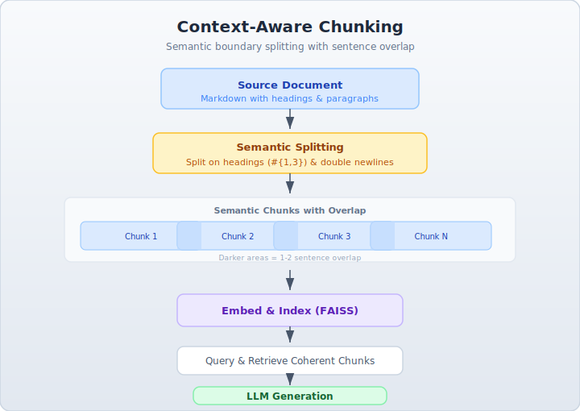

**Code:** [`src/context_aware_chunking/context_aware_chunking.py`](src/context_aware_chunking/context_aware_chunking.py)

---

### 8. Late Chunking

**What it does:** Processes the full document through the embedding model first, then splits the resulting token embeddings into chunks. Each chunk embedding retains full-document context.

**Why it helps:** Traditional chunk-then-embed loses cross-chunk context. Late chunking ensures every chunk's embedding is informed by the entire document, improving retrieval for context-dependent passages.

**Architecture:**

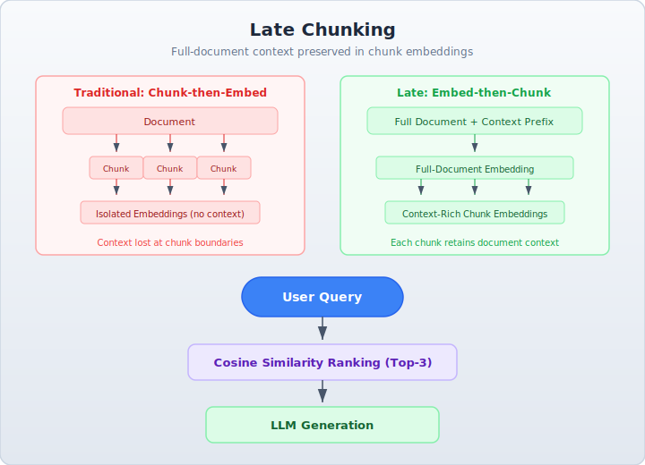

**Code:** [`src/late_chunking/late_chunking.py`](src/late_chunking/late_chunking.py)

---

### 9. Hierarchical RAG

**What it does:** Builds a two-level index — document/section summaries (L1) for coarse retrieval and detailed chunks (L2) for fine-grained retrieval. First identifies relevant sections, then drills into their details.

**Why it helps:** Searching over summaries first narrows the scope efficiently, then detailed retrieval within relevant sections produces precise context. This mirrors how humans skim then deep-read.

**Architecture:**

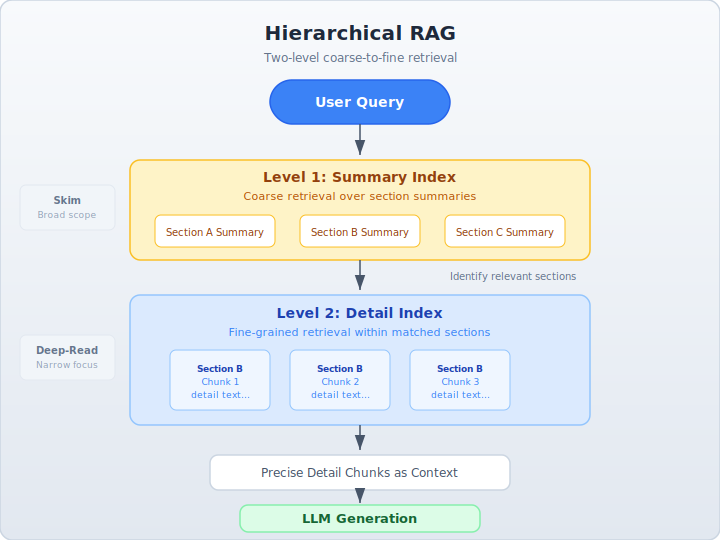

**Code:** [`src/hierarchical_rag/hierarchical_rag.py`](src/hierarchical_rag/hierarchical_rag.py)

---

### 10. Fine-Tuned RAG

**What it does:** Fine-tunes the embedding model or generation LLM on domain-specific question-answer pairs to improve both retrieval accuracy and answer quality for a target domain.

**Why it helps:** General-purpose models may not capture domain-specific terminology or reasoning patterns. Fine-tuning aligns the model with your data distribution for better precision.

**Architecture:**

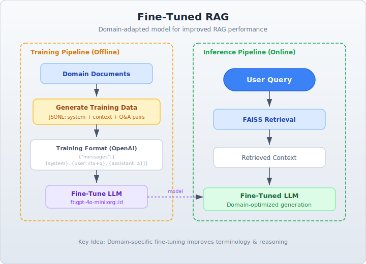

**Code:** [`src/fine_tuned_rag/fine_tuned_rag.py`](src/fine_tuned_rag/fine_tuned_rag.py)

---

### 11. HyDE (Hypothetical Document Embeddings)

**What it does:** Generates a hypothetical answer to the query using the LLM, then embeds that hypothetical document and uses it as the retrieval query instead of the original question.

**Why it helps:** Queries and documents live in different semantic spaces — questions are short and abstract while answers are detailed. HyDE bridges this gap by searching with a document-like embedding.

**Architecture:**

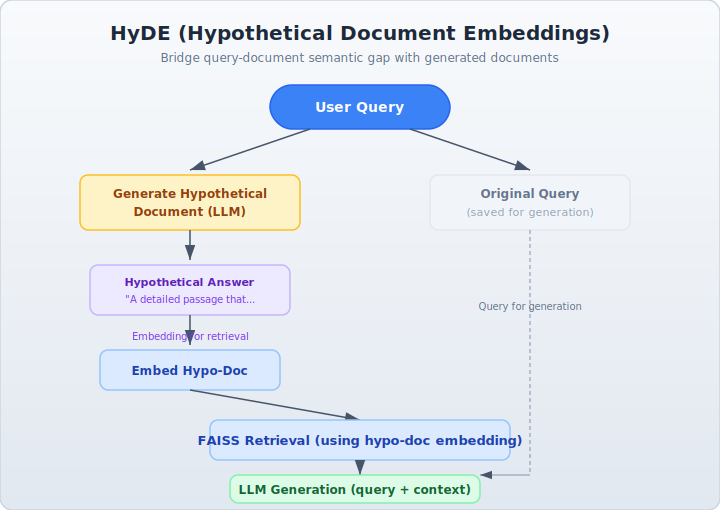

**Code:** [`src/hyde_rag/hyde_rag.py`](src/hyde_rag/hyde_rag.py)

---

### 12. RAG-Fusion

**What it does:** Generates multiple query variants, retrieves for each, and combines results using Reciprocal Rank Fusion (RRF) to produce a single ranked list.

**Why it helps:** Different query phrasings surface different relevant documents. RRF rewards documents that appear consistently across multiple retrieval runs, improving both precision and recall.

**Architecture:**

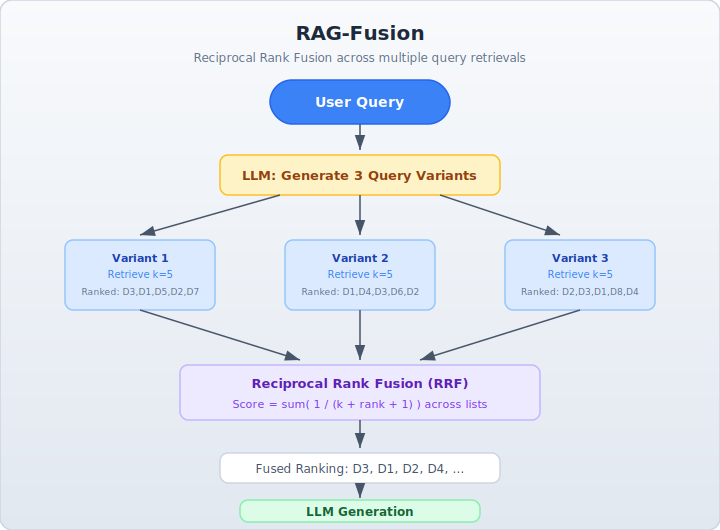

**Code:** [`src/fusion_rag/fusion_rag.py`](src/fusion_rag/fusion_rag.py)

---

### 13. Self-RAG

**What it does:** The model self-reflects at each step — deciding whether retrieval is needed, generating a response, then verifying if the response is grounded in the retrieved context.

**Why it helps:** Not every query needs retrieval, and not every generated answer is faithful. Self-reflection tokens let the model skip unnecessary retrieval and catch ungrounded claims before returning them.

**Architecture:**

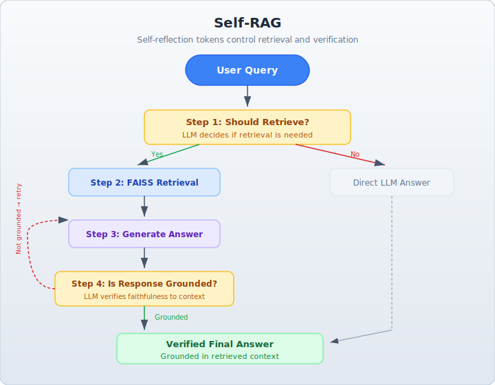

**Code:** [`src/self_rag/self_rag.py`](src/self_rag/self_rag.py)

---

### 14. Corrective RAG (CRAG)

**What it does:** After retrieval, an LLM grades each document for relevance. If too few documents pass the quality check, it falls back to web search to supplement the context.

**Why it helps:** Retrieval can return plausible but irrelevant results. CRAG catches low-quality retrieval before it reaches generation, and web search provides a safety net for knowledge gaps.

**Architecture:**

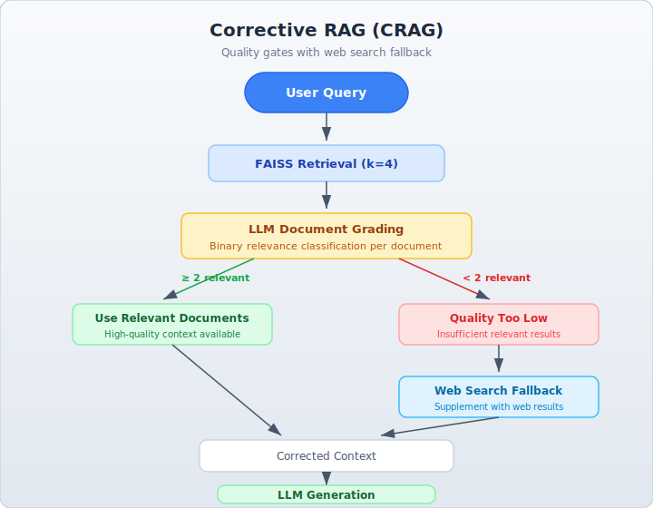

**Code:** [`src/corrective_rag/corrective_rag.py`](src/corrective_rag/corrective_rag.py)

---

### 15. Adaptive RAG

**What it does:** Classifies each query by complexity (simple, moderate, complex) and routes it to the appropriate retrieval strategy — direct search, query expansion, or multi-step decomposition.

**Why it helps:** One-size-fits-all retrieval wastes compute on simple queries and under-serves complex ones. Adaptive routing matches retrieval effort to query difficulty for optimal cost and quality.

**Architecture:**

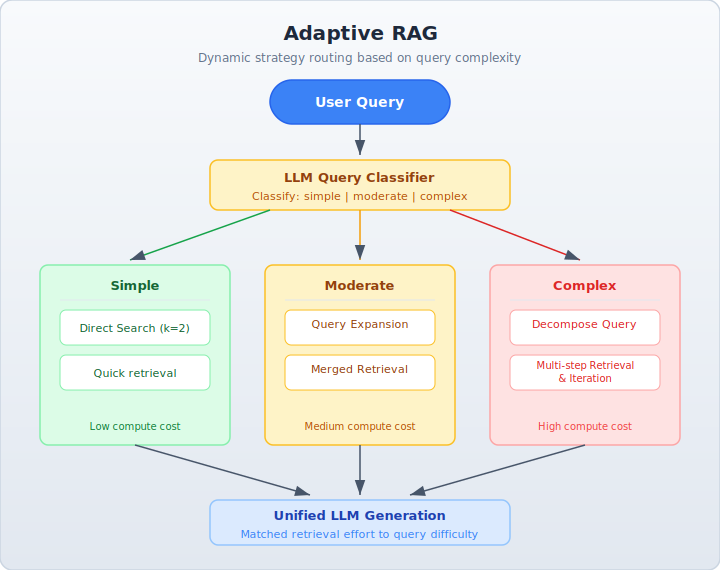

**Code:** [`src/adaptive_rag/adaptive_rag.py`](src/adaptive_rag/adaptive_rag.py)

---

## Security Considerations

All code samples follow these security practices:

- **No hardcoded secrets** — API keys are read from environment variables via `os.environ`
- **Input grounding** — LLM responses are constrained to retrieved context ("Answer based on context only") to reduce hallucination and prompt injection risk
- **No arbitrary code execution** — no use of `eval()`, `exec()`, or shell commands from user/LLM output
- **Minimal dependencies** — only well-maintained, widely-used libraries

For production use, also consider: rate limiting, input sanitization, output filtering, and access controls on your vector store.

## Project Structure

```
ml-rag-strategies/
├── README.md
├── requirements.txt
├── architecture/          # High-level architecture diagrams (SVG)
└── src/
    ├── reranking/              # Strategy 1: Re-Ranking
    ├── agentic_rag/            # Strategy 2: Agentic RAG
    ├── knowledge_graph_rag/    # Strategy 3: Knowledge Graph RAG
    ├── contextual_retrieval/   # Strategy 4: Contextual Retrieval
    ├── query_expansion/        # Strategy 5: Query Expansion
    ├── multi_query_rag/        # Strategy 6: Multi-Query RAG
    ├── context_aware_chunking/ # Strategy 7: Context-Aware Chunking
    ├── late_chunking/          # Strategy 8: Late Chunking
    ├── hierarchical_rag/       # Strategy 9: Hierarchical RAG
    ├── fine_tuned_rag/         # Strategy 10: Fine-Tuned RAG
    ├── hyde_rag/               # Strategy 11: HyDE
    ├── fusion_rag/             # Strategy 12: RAG-Fusion
    ├── self_rag/               # Strategy 13: Self-RAG
    ├── corrective_rag/         # Strategy 14: Corrective RAG (CRAG)
    └── adaptive_rag/           # Strategy 15: Adaptive RAG
```
